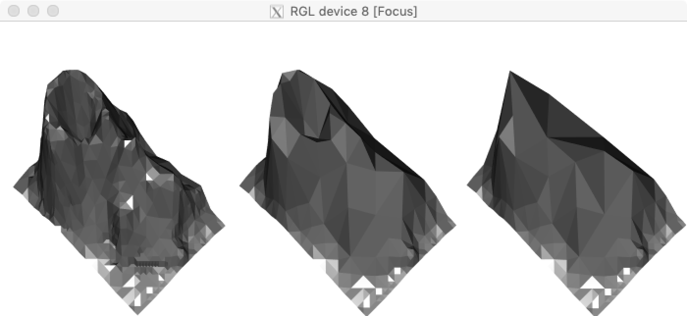

<!-- README.md is generated from README.Rmd. Please edit that file

library(rmarkdown)
render('README.Rmd', output_format=md_document())

-->
```{r, echo = FALSE}
knitr::opts_chunk$set(
  comment = "##",
  fig.path = "extra/figures/README-",
  error = TRUE
)
```
# rtini - Right Triangulated Irregular Network Surface Approximation

## Overview

A vectorized adaption of [Vladimir Agafonkin's MARTINI][1] implementation of the
Evans etal. [Right-Triangulated Irregular Networks (RTIN)][2] surface
approximation algorithm.  This implementation supports a broader range of
dimensions and should also be faster in many use cases[^faster].

The workhorse functions are `rtini_error()` and `rtini_mesh()`.  The former
computes the surface approximation error at all levels of approximation, and
the latter extract mesh triangles subject to an error tolerance.

This is package is experimental, lightly tested, and not intended for production
use.  It is unlikely this package will ever be posted on CRAN, but if you are
interested in the functionality and know of a GPL licensed home for it do let me
know.

```{r eval=FALSE}
library(rtini)

err <- rtini_error(volcano)

library(rgl)
par3d(windowRect=c(100,100,800,400))
mfrow3d(nr=1, nc=3, sharedMouse=TRUE)
for(tol in c(2, 10, 30)){
  next3d()
  ids <- rtini_extract(err, tol)
  xyz <- id_to_coord(ids, volcano)
  triangles3d(xyz, color='grey50')
}
```


This implementation works for any elevation map with odd number of rows and
columns, but works best when the dimensions are (2^k + 1, n * 2^k + 1) as
otherwise many tiles must be split just to get them to conform with each other,
as can be seen here with `volcano` along the bottom and right edges.

## Installation

This package is only available on github.  Use your favorite package installer
or:

```{r eval=FALSE}
f.dl <- tempfile()
f.uz <- tempfile()
github.url <- 'https://github.com/brodieG/rtini/archive/master.zip'
download.file(github.url, f.dl)
unzip(f.dl, exdir=f.uz)
install.packages(file.path(f.uz, 'rtini-master'), repos=NULL, type='source')
unlink(c(f.dl, f.uz))
```

## Acknowledgments

* Vladimir Agafonkin for the implementation of and [wonderful post][1] on the
  topic.
* William Evans, David Kirkpatrick, and Gregg Townsend for the [original
  paper][2].
* Daniel Adler, Duncan Murdoch, etal. for `rgl` with which we made the image in
  this README.
* R Core for developing and maintaining such a wonderful language.

[^faster]: Error calculation should be generally faster, and mesh extraction
should be comparable except when the reduced mesh has very large numbers of
triangles, in which case the JavaScript implementation is faster.

[1]: https://observablehq.com/@mourner/martin-real-time-rtin-terrain-mesh
[2]: https://www.cs.ubc.ca/~will/papers/rtin.pdf
